# <div  style="font-family:'arial black', sans-serif,monospace; text-align: left; min-height: 100px; vertical-align:bottom;" >  <span style="left: 0; bottom: 0; padding-right: 120px; padding-bottom: 10px"> <b> L0. Lab Introduction </b></span>  </div>

## Keywords:

`Electronics`, `Laboratory`, `Instrumentation`, `Arduino`, `IDE`, `Seeeduino`

In this lab, we will describe the main tools available in an instrumentation laboratory and how to set up the Arduino on your computer.


## I. Laboratory Tools
<div class="title" style="width:100%; background:#FDC86E;font-family:'arial black',monospace; text-align: center; padding: 7px 0; border-radius: 5px 50px;margin-top:-15px" >
</div>

### Multimeter

A Multimeter is known as a multitester or VOM (Volt-Ohm Milliammeter). It is an all-in-one electronic measuring instrument that combines several measurement functions. Thus, it’ll be able to troubleshoot issues with your circuit or electronic designs!

A typical multimeter nowadays looks like this:

<p align="center">
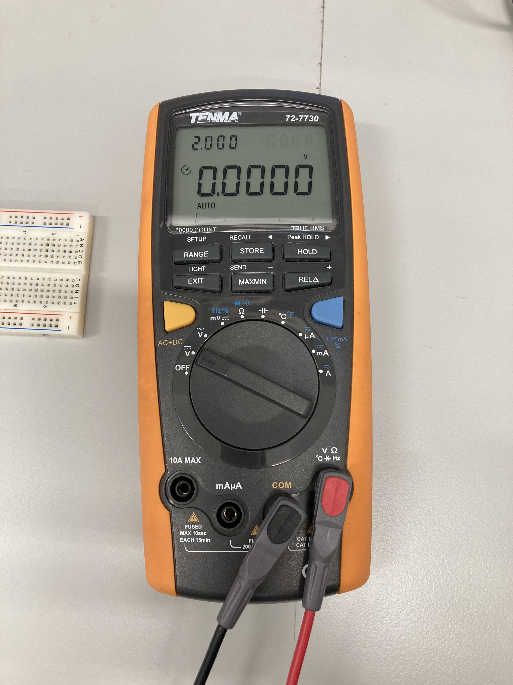 
</p>

As you can see, you have a selection knob that allows you to select what to measure.

Selecting the `V` means you are measuring *Voltage* and using the multimeter probes you can measure the voltage across two terminals:

<p align="center">
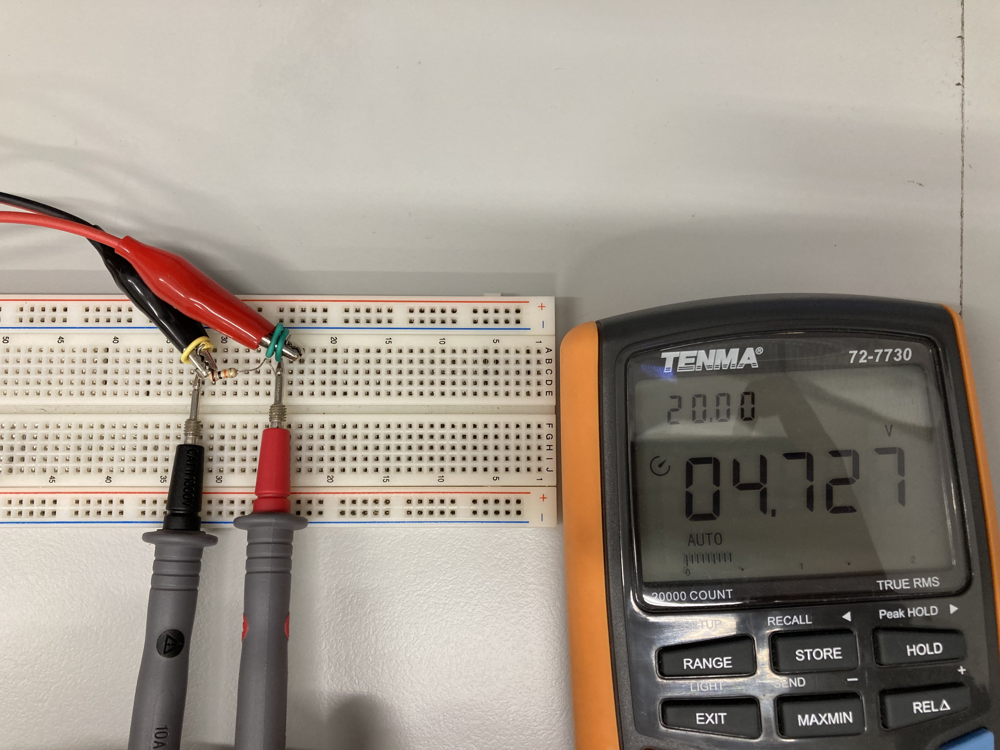 
</p>

Another very useful feature of multimeters is the ability to test for continuity. This can be used to check if there is a short circuit in your circuit or to verify if something is connected properly. Just turn the knob to the continuity test position and press the blue button. Now if you touch the probes together the multimeter will *beep*.

<p align="center">
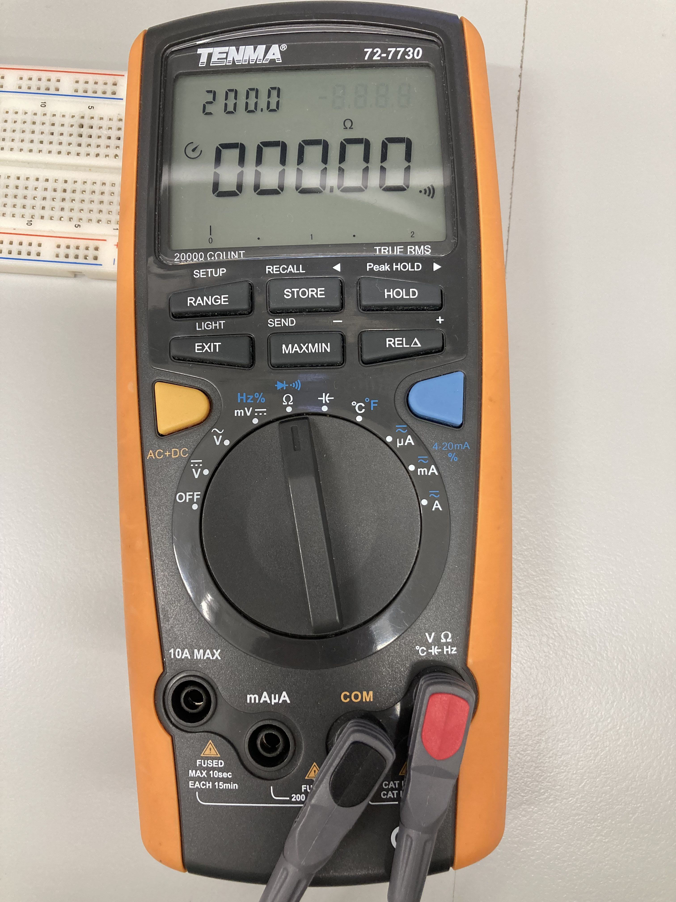 
</p>

--- 

### DC Power Supply

A DC power supply is a type of power supply that gives direct current (DC) voltage to power a device. Because DC power supply is commonly used on an engineer's or technician's bench for a ton of power tests, they are also often called a "bench power supply".

A typical DC power supply looks like this:

<p align="center">
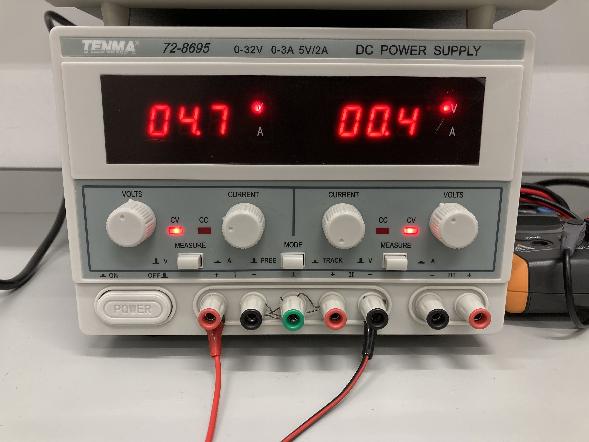 
</p>

The probes connected to the power supply are the following:

<p align="center">
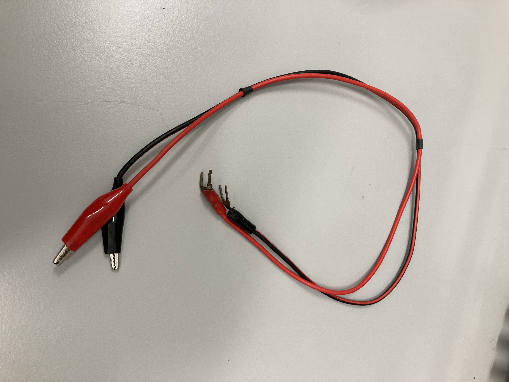 
</p>

The power supply has knobs that allow it to select the desired voltage and the current it outputs. Remember that if the current is 0, the output will have 0 volts.

Some power supplies even have an `OUTPUT` button that allows toggling the output voltage between `ON` and `OFF`.

<p align="center">
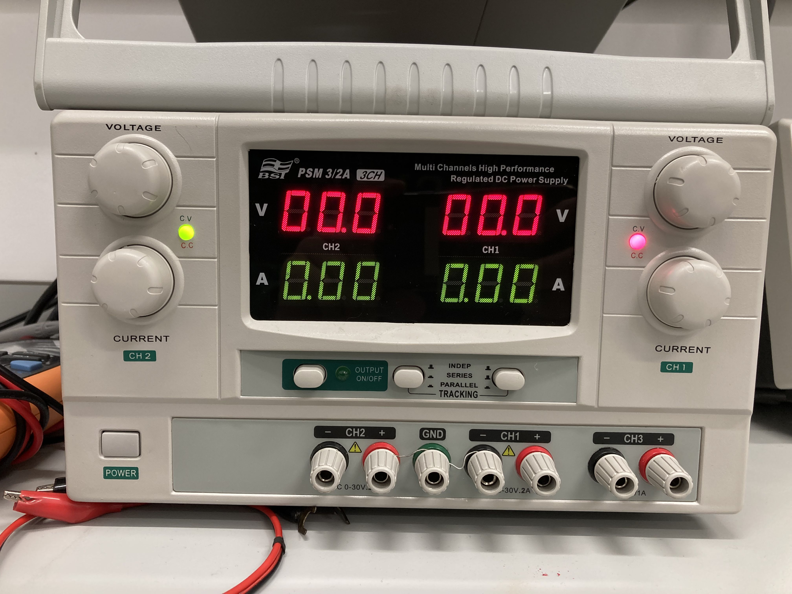 
</p>

You can easily power your circuit with a power supply:

<p align="center">
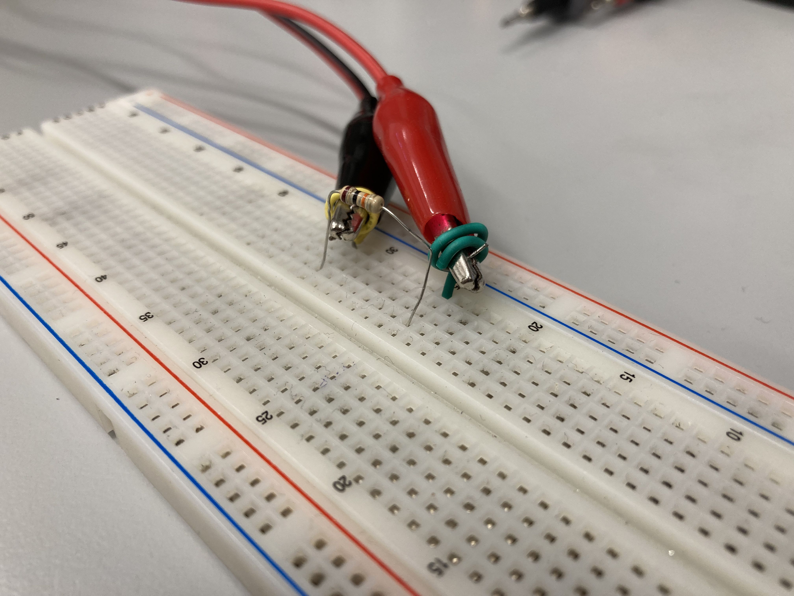 
</p>

><h3 style="">ATTENTION!</h3>
>The power supply is capable of damaging your circuit. Always be extra careful when using this device. Always verify the selected voltage before connecting to your circuit. Voltages too high can damage your parts and even be dangerous to you.


---
### Function Generator

A function generator is usually a piece of electronic test equipment or software used to generate different types of electrical waveforms over a wide range of frequencies. Some of the most common waveforms produced by the function generator are the sine wave, square wave, triangular wave, and sawtooth shapes.

<p align="center">
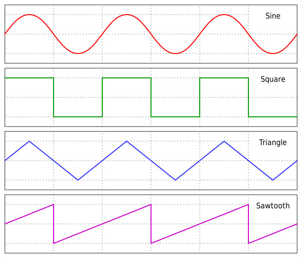 
</p>

Function generators are used in the development, test, and repair of electronic equipment. For example, they may be used as a signal source to test amplifiers or to introduce an error signal into a control loop. 


A typical function generator looks like this:

<p align="center">
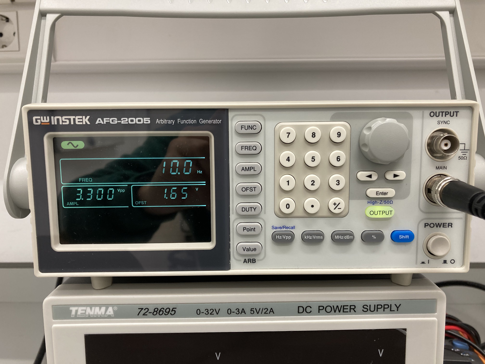 
</p>

To start using a function generator, make sure you connect the BNC-crocodile cable to the **MAIN** output of the generator.

<p align="center">
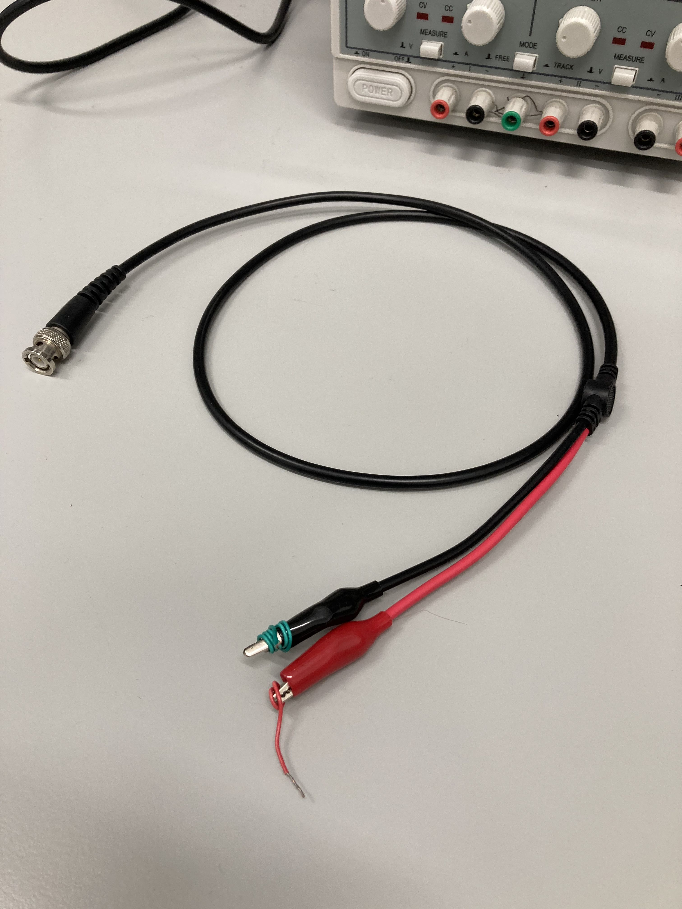 
</p>

The function generator allows you to select the characteristics of the output signal. You can select its shape, frequency, amplitude, *etc*. As an example, to select a frequency of 10 Hz, you press the `FREC`button, then press the number `10`, and finally, press the `Hz/Vpp` button.

Note that if the `OUTPUT` button is not activated, no signal is generated.


><h3 style="">ATTENTION!</h3>
>Like the DC Power Supply, the function generator can be dangerous to you and your circuit. Always make sure you selected the correct settings before turning on the `OUTPUT` button. A badly configured function generator can damage electronic components.

--- 

### Oscilloscope

An oscilloscope is a piece of equipment used to measure electronic signals and is found in many scientific laboratories. It is used to observe varying-signal voltages on a two-dimensional grid representing time. When connected to a power source through a probe, the oscilloscope displays the corresponding real-time waveform immediately. Although mostly used in scientific and engineering fields, they are also used in other fields such as telecommunications and medicine.

A typical oscilloscope looks like this:

<p align="center">
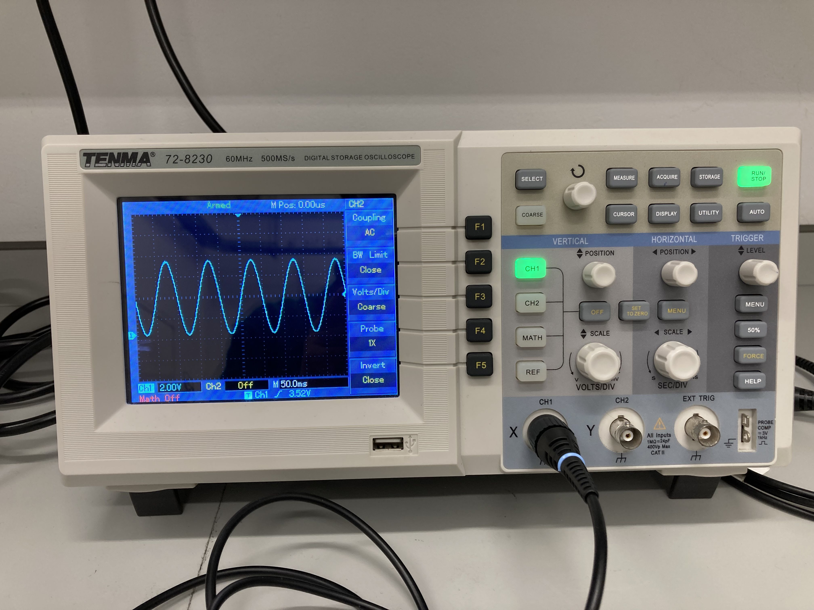 
</p>

You can adjust what you see on the main screen by using the knobs and buttons on the right side. Modern oscilloscopes have an `AUTO` adjustment button which automatically adjusts the window to fit the signal being measured. Just try it!

Another very useful feature of digital oscilloscopes is that you can measure characteristics of the signals:

<p align="center">
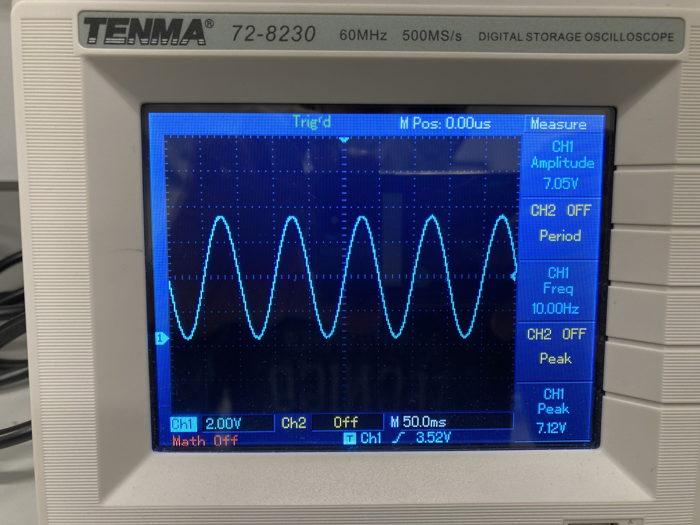 
</p>

You can access this by pressing the `MEASURE` button.

To connect the oscilloscope to your circuit use the following probes:

<p align="center">
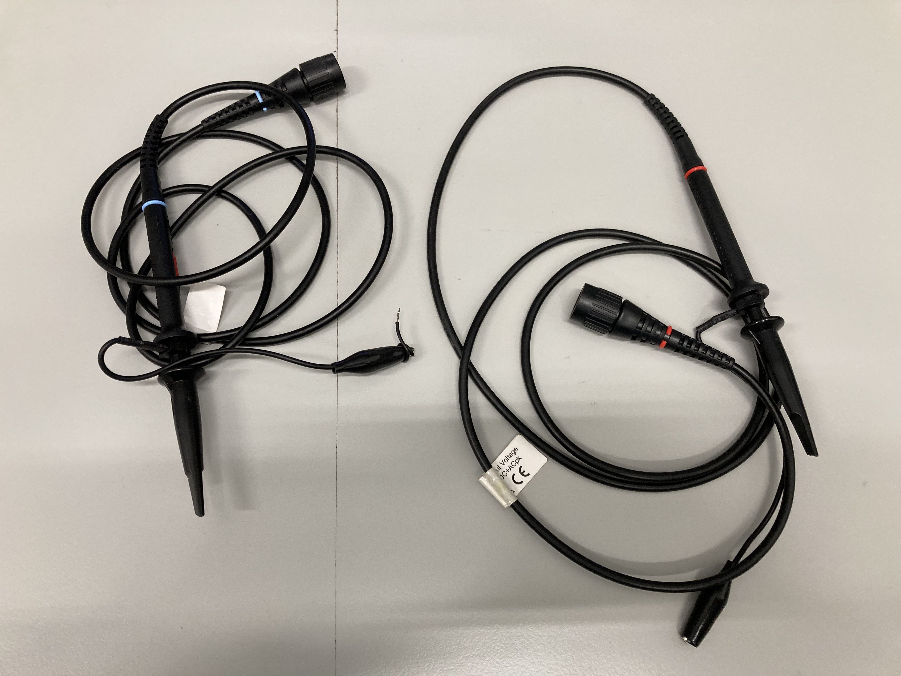 
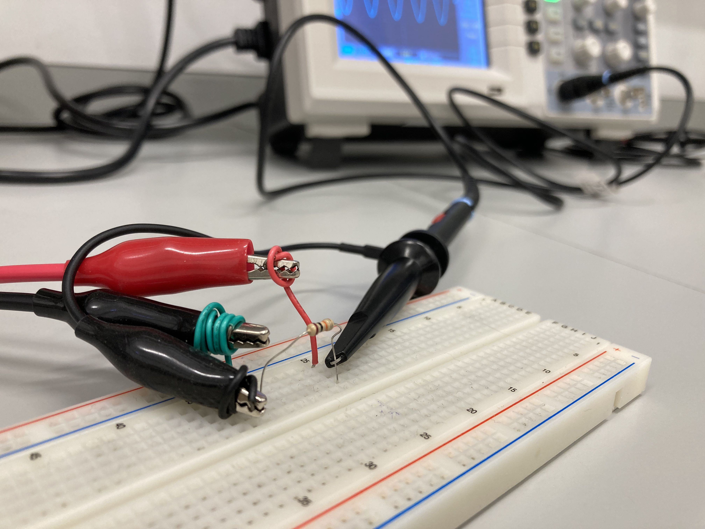 
</p>

The crocodile side cable connects to `GROUND`.


<br>

## II. Installing the Arduino IDE
<br>
<div class="title"style="width:100%; background:#FDC86E;font-family:'arial black',monospace; text-align: center; padding: 7px 0; border-radius: 5px 50px;margin-top:-15px" >
</div>
<br>

You need to download and install the latest version of the Arduino IDE from: https://www.arduino.cc/en/software [[1]](#reference_1). If you don’t have the latest version installed, uninstall Arduino IDE and install it again. Otherwise, it may not work.

After you have the latest Arduino IDE software installed on your computer, open the software to confirm that it is working. 

Hovering with the mouse pointer on each button shows a brief description of its function. The following figure 
summarizes these functionalities:

<table title="Overview of the Arduino IDE Graphical User Interface (GUI)">
    <caption>Overview of the Arduino IDE Graphical User Interface (GUI)</caption>
    <tr>
<td>  </td>
<td>  </td>
</tr></table>

> **Note:**
To get a better understanding of the Arduino Software (IDE) and its functionalities, a more comprehensive guide on this topic is available at: https://www.arduino.cc/en/Guide/Environment [[2]](#reference_2).

<br>

## III. Installing the Seeed Boards in Arduino IDE
<br>
<div class="title"style="width:100%; background:#FDC86E;font-family:'arial black',monospace; text-align: center; padding: 7px 0; border-radius: 5px 50px;margin-top:-15px" >  </div>
<br>

The Arduino IDE can be used to program other devices besides Arduinos. We'll be using the Seeeduino Nano.

<p align="center">
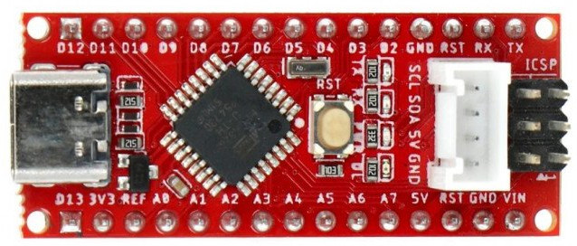 
</p>


To install the add-on to support this device, follow these next instructions:

1. In the Arduino IDE, go to `File > Preferences`:<br>

<p align="center">

</p>

<br>

2. Enter the following links [[3]](#reference_3):

```
https://files.seeedstudio.com/arduino/package_seeeduino_boards_index.json, https://raw.githubusercontent.com/Seeed-Studio/Seeed_Platform/master/package_legacy_seeeduino_boards_index.json
```

Into the `Additional Board Manager URLs` in the `Preferences` window as shown in the figure below. Then, click the `OK` button.<br>

<p align="center">
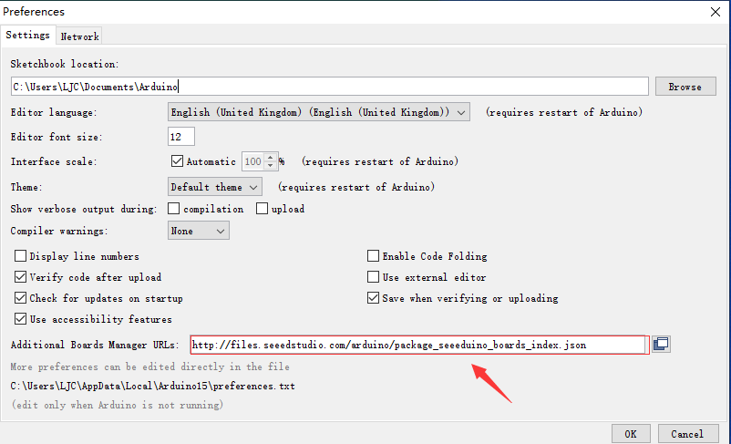 
</p>

<br>

> **Note:** 
If you already have the URL of another board in the "Additional Board Manager URLs" field, you can separate the URLs with a comma as displayed in the figure above.

3. Open the Boards Manager. Go to `Tools > Board > Boards Manager`<br>

<p align="center">
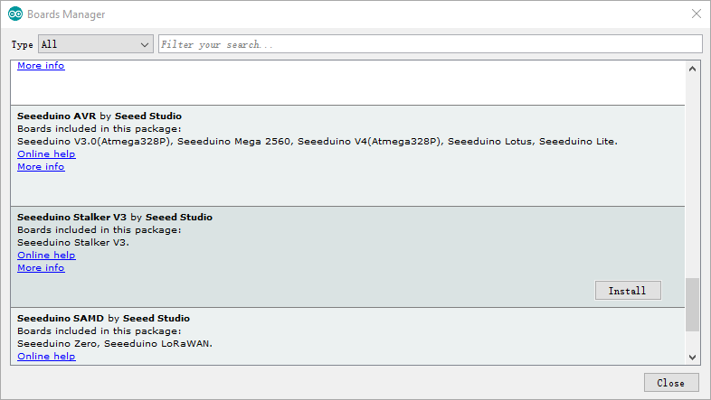 
</p>

<br>

4. Search for Seeeduino Nano and press the "Install" button for the "**Seeeduino AVR** by **Seeed Studio**".

5. The add-on should be installed after a few seconds.

6. Search for Seeeduino XIAO and press the "Install" button for the "**Seeeduino SAMD Boards** by **Seeed Studio**".

7. You can now select the correct board by clicking on `Tools > Board`.

<br>


## IV. Testing your Setup 
<br>
<div class="title"style="width:100%; background:#FDC86E;font-family:'arial black',monospace; text-align: center; padding: 7px 0; border-radius: 5px 50px;margin-top:-15px" >  </div>
<br>

To test your setup, upload the Blink sketch, one of the built-in examples of the Arduino IDE that can be loaded from `File > Examples > 01.Basics > Blink`:

<p align="center">

</p>

<br>

Upon successful completion of the process, the LED on the front of the board should be **ON** for one second, then **OFF** for one second, repeatedly.


<br>

## V. References
<br>
<div class="title"style="width:100%; background:#FDC86E;font-family:'arial black',monospace; text-align: center; padding: 7px 0; border-radius: 5px 50px;margin-top:-15px" >  </div>
<br>

<a id='reference_1'></a> 1\. https://www.arduino.cc/en/software

<a id='reference_2'></a> 2\. https://www.arduino.cc/en/Guide/Environment

<a id='reference_3'></a> 3\. https://wiki.seeedstudio.com/Seeed_Arduino_Boards/


<div style="height:100px; border-radius:10px;text-align:center"> 
     
    
</div> 

```Contributors: Afonso Raposo; Prof. Hugo Silva```